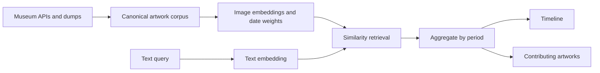

# Mnemosyne

Mnemosyne is a “Google Ngram for art”: search a visual idea, see how its signal changes across time, and trace every point back to example artworks.

This repository starts with a deliberately narrow vertical slice. It validates the complete product loop against live Art Institute of Chicago collection data:

1. Enter a concept such as `horse` or `loneliness`.
2. Retrieve dated artworks from a real museum API.
3. Group the result sample by decade.
4. Tap any chart point to inspect and open the artworks behind it.

The current curve is explicitly a metadata-search result distribution, **not** a historical prevalence claim. The production plan replaces metadata retrieval with a corpus-wide image–text embedding index while retaining the interface and evidence trail.

## Run locally

```bash
npm install
npm run dev
```

Open [http://localhost:3000](http://localhost:3000). No API key or local dataset is required.

```bash
npm run check
npm run build
```

## High-level architecture



The product has two inseparable outputs: a temporal trace and the artworks that produced it. Keeping the evidence trail first-class makes surprising peaks inspectable and exposes collection bias instead of hiding it behind a smooth chart.

See [docs/architecture.md](docs/architecture.md) for the technical plan and the decisions behind it.

## Deployment from a phone

The app is a standard Next.js project and is ready for Git-based preview deployment. Import the repository into Vercel once; after that, every branch or pull request gets a shareable preview automatically. A phone-only loop is then:

`request change in Codex → review preview → merge PR → production deploy`

## Data attribution

The vertical slice uses the [Art Institute of Chicago public API](https://api.artic.edu/docs/) and its IIIF image service. Artwork cards link to the museum record, and the interface surfaces public-domain status when the API provides it.
