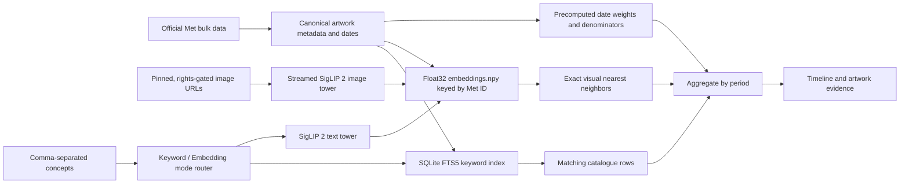

# Mnemosyne

Mnemosyne is a “Google Ngram for art”: search a visual idea, see how its signal changes across time, and trace every point back to example artworks.

The repository contains the interaction slice and two artifact-backed retrieval
paths. The quickest full-corpus path uses the Met's official Open Access export
and a local SQLite FTS5 index:

1. Build a versioned corpus of every dateable Met record in the selected date range.
2. Precompute normalized date weights and bin denominators once.
3. Build a full-text index over titles, tags, artists, cultures, media, object
   types, classifications, periods, dynasties, geography, and departments.
4. Search and aggregate entirely from local immutable artifacts, plotting the
   date-weighted matching share of each period.
5. Compare one to five comma-separated concepts and inspect matching works.

The embedding path provides visual-concept retrieval. Its offline builder
streams each artwork through a pinned SigLIP 2 image tower, discards the pixels,
and publishes a normalized float32 `embeddings.npy` matrix keyed back to compact
Met metadata. That matrix is the canonical exact inner-product index; an exact
FAISS `IndexFlatIP` file is optional. Requests run only the matching text tower,
exact retrieval, and global top-1% concentration lift.

The web app exposes a URL-backed **Keyword / Embedding** toggle. Keyword is the
default; embedding mode is represented by `?searchMode=embedding`. In artifact
mode the Next.js route dispatches only to the corresponding allowlisted local
service URL, so one unavailable backend cannot silently substitute for the
other. The Art Institute of Chicago demo supports keyword search only, and its
chart is explicitly labelled **relative result density**, not historical
prevalence or concentration lift.

## Run locally

```bash
npm install
cp .env.example .env.local
npm run dev
```

Open [http://localhost:3000](http://localhost:3000). The example environment uses
the keyless `catalogue-demo` mode, so no API key or local dataset is required.

Enter concepts such as `horse, ship, train`. A comma inside one concept can be
quoted: `"still life, fruit", flowers`. Up to five unique lines are supported.

```bash
npm run check
npm test
npm run build
```

## Run Art Ngram over the Met

Clone a pinned copy of the Met's official Open Access data, build the local FTS
and denominator artifacts once, and start the keyword service:

```bash
git clone --depth 1 https://github.com/metmuseum/openaccess.git /path/to/met-openaccess
git -C /path/to/met-openaccess rev-parse HEAD

python3 -m pip install -r pipeline/requirements.txt
python3 -m pipeline build-met \
  --input /path/to/met-openaccess/MetObjects.csv \
  --output /path/to/artifacts/met-openaccess-v1 \
  --corpus-version met-openaccess-v1 \
  --source-revision COPY_THE_COMMIT_PRINTED_ABOVE \
  --retrieved-at 2026-08-03T00:00:00Z \
  --min-year -15000 \
  --max-year 2029

python3 -m pip install -e ./service
mnemosyne-search \
  --artifacts /path/to/artifacts/met-openaccess-v1 \
  --met-keyword \
  --host 127.0.0.1 \
  --port 8765
```

`build-met` copies the source CSV, emits the date artifacts, and creates
`met-search.sqlite3`. It does not call the Met API, download images, or build
embeddings by default. An optional saved `hasImages` response can mark image
availability with `--image-ids`; `--fetch-image-ids` is the explicit one-time
network alternative. Copy `.env.example` to `.env.local`, set
`MNEMOSYNE_SEARCH_MODE=artifact` and
`MNEMOSYNE_KEYWORD_SEARCH_SERVICE_URL=http://127.0.0.1:8765/v1/search`, run
`npm run dev`, and the web route will proxy keyword requests to the service.
Search and aggregation remain local; by default the service uses the keyless Met
object endpoint only to resolve image metadata for the selected evidence cards.
Pass `--met-offline-evidence` to disable those lookups. The former
`MNEMOSYNE_SEARCH_SERVICE_URL` remains a keyword-only compatibility fallback.

The plotted value is `matching date weight / eligible date weight` for each
bin. It measures the frequency of a term in Met catalogue metadata, not the
visual prevalence of that concept in the images.

## Run the embedding search path

The corpus and embedding builders are documented in
[`pipeline/README.md`](pipeline/README.md). They use official Met metadata, a
pinned clean image-URL table, and a pinned local SigLIP 2 revision. Artwork
pixels can be streamed directly into bounded embedding batches and discarded;
the durable bundle stores vectors, Met IDs, compact result metadata, dates,
rights, and input hashes rather than an image archive. No hosted inference API
or end-user API key is involved. For Met URLs, the builder starts with the
smaller `web-large` derivative and re-fetches the original whenever a decoded
dimension falls below the model's 224 px input floor; the actual URL,
dimensions, and response hash are retained as provenance.

```bash
python3 -m pip install -r pipeline/requirements.txt
python3 -m pipeline build --help
python3 -m pipeline embed --help
```

Start the persistent local query service after building an embedding bundle:

```bash
python3 -m pip install -e './service[siglip2,faiss]'
mnemosyne-search \
  --artifacts /path/to/embedding-bundle \
  --siglip2 \
  --device auto \
  --host 127.0.0.1 \
  --port 8766
```

On macOS, embedding mode defaults to the exact NumPy index because common FAISS
and PyTorch wheels load conflicting OpenMP runtimes. `--force-faiss` is available
for a deployment whose wheels have been verified compatible; do not rely on an
unsafe duplicate-runtime environment workaround.

To enable the toggle, run the keyword service on port 8765 and the embedding
service on port 8766 at the same time, then configure:

```dotenv
MNEMOSYNE_SEARCH_MODE=artifact
MNEMOSYNE_KEYWORD_SEARCH_SERVICE_URL=http://127.0.0.1:8765/v1/search
MNEMOSYNE_EMBEDDING_SEARCH_SERVICE_URL=http://127.0.0.1:8766/v1/search
```

The Next.js route sends `searchMode=keyword|embedding` to the selected service;
model paths and service details stay server-side, and the end user supplies no
API key. Local artifact images are served through the originating backend and a
mode-aware same-origin web route. See [`service/README.md`](service/README.md)
for the complete artifact contract and fixture-only startup command.

## Verification

```bash
python3 -m unittest discover -s pipeline/tests -v
PYTHONPATH=service python3 -m unittest discover -s service/tests -v
npm test
npm run check
npm run build
```

The suites include real boundary tests for both paths: temporary corpus builds,
Met keyword frequency and evidence, and embedding-based independent series.

## High-level architecture



The product has two inseparable outputs: a temporal trace and the artworks that produced it. Keeping the evidence trail first-class makes surprising peaks inspectable and exposes collection bias instead of hiding it behind a smooth chart.

See [`docs/architecture.md`](docs/architecture.md) for the metric definition,
corpus caveats, validation gates, and scaling decisions.

## Deployment from a phone

The catalogue fallback is a standard Next.js deployment. The artifact-backed
path additionally needs the persistent Python service and its local model/index
bundle; it should not be placed in a short-lived serverless function.

`request change in Codex → review preview → merge PR → production deploy`

## Data attribution

The fallback uses the [Art Institute of Chicago public API](https://api.artic.edu/docs/)
and its IIIF image service. Artifact builds retain source-record, metadata
license, rights, credit, and public-domain fields; dataset and image terms must
still be reviewed before a production corpus is distributed.
