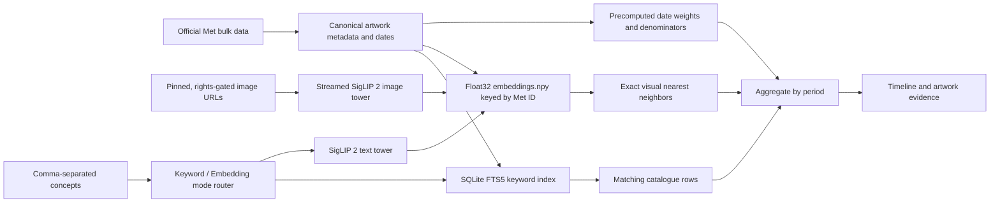

# Mnemosyne

Mnemosyne is a “Google Ngram for art”: search a visual idea, see how its signal changes across time, and trace every point back to example artworks.

The public product has two deliberately different search modes. **Metadata**
uses the existing D1/FTS path to match catalogue text. **Visual** accepts one to
five arbitrary phrases, embeds them at request time with the exact SigLIP text
tower paired to the existing artwork vectors, and returns independent timelines
plus period-specific artwork evidence. The browser calls only same-origin web
routes; model weights, artifacts, and private backend credentials stay on the
server.

The repository contains the interaction slice and two artifact-backed retrieval
paths. The quickest full-corpus path uses the Met's official Open Access export
and a local SQLite FTS5 index:

1. Build a versioned corpus of every dateable Met record in the selected date range.
2. Precompute normalized date weights and bin denominators once.
3. Build a full-text index over titles, tags, artists, cultures, media, object
   types, classifications, periods, dynasties, geography, and departments.
4. Search and aggregate entirely from local immutable artifacts, plotting the
   date-weighted matching share of each period.
5. Compare one to five comma-separated concepts and inspect matching works.

The embedding path provides visual-concept retrieval. Its offline builder
streams each artwork through a pinned SigLIP 2 image tower, discards the pixels,
and publishes a normalized float32 `embeddings.npy` matrix keyed back to compact
Met metadata. That matrix is the canonical exact inner-product index; an exact
FAISS `IndexFlatIP` file is optional. Requests run only the matching text tower,
exact retrieval, and global top-1% concentration lift.

The web app exposes URL-backed **Metadata / Visual** modes while retaining the
internal `keyword` and `embedding` values. Visual is the default and is not
restricted to a checked-in vocabulary or autocomplete catalog.

## Run locally

```bash
npm install
cp .env.example .env.local
npm run dev
```

Open [http://localhost:3000/?searchMode=keyword](http://localhost:3000/?searchMode=keyword).
The example environment uses the keyless `catalogue-demo` metadata preview, so
no API key or local dataset is required for Metadata mode. Run the embedding
service and set its server-only URL to use the default Visual mode locally.

Enter concepts such as `horse, ship, train`. A comma inside one concept can be
quoted: `"still life, fruit", flowers`. Up to five unique lines are supported.

```bash
npm run check
npm test
npm run build
```

## Run Art Ngram over the Met

Clone a pinned copy of the Met's official Open Access data, build the local FTS
and denominator artifacts once, and start the keyword service:

```bash
git clone --depth 1 https://github.com/metmuseum/openaccess.git /path/to/met-openaccess
git -C /path/to/met-openaccess rev-parse HEAD

python3 -m pip install -r pipeline/requirements.txt
python3 -m pipeline build-met \
  --input /path/to/met-openaccess/MetObjects.csv \
  --output /path/to/artifacts/met-openaccess-v1 \
  --corpus-version met-openaccess-v1 \
  --source-revision COPY_THE_COMMIT_PRINTED_ABOVE \
  --retrieved-at 2026-08-03T00:00:00Z \
  --min-year -15000 \
  --max-year 2029

python3 -m pip install -e ./service
mnemosyne-search \
  --artifacts /path/to/artifacts/met-openaccess-v1 \
  --met-keyword \
  --host 127.0.0.1 \
  --port 8765
```

`build-met` copies the source CSV, emits the date artifacts, and creates
`met-search.sqlite3`. It does not call the Met API, download images, or build
embeddings by default. An optional saved `hasImages` response can mark image
availability with `--image-ids`; `--fetch-image-ids` is the explicit one-time
network alternative. Copy `.env.example` to `.env.local`, set
`MNEMOSYNE_SEARCH_MODE=artifact` and
`MNEMOSYNE_KEYWORD_SEARCH_SERVICE_URL=http://127.0.0.1:8765/v1/search`, run
`npm run dev`, and the web route will proxy keyword requests to the service.
Search and aggregation remain local; by default the service uses the keyless Met
object endpoint only to resolve image metadata for the selected evidence cards.
Pass `--met-offline-evidence` to disable those lookups. The former
`MNEMOSYNE_SEARCH_SERVICE_URL` remains a keyword-only compatibility fallback.

The plotted value is `matching date weight / eligible date weight` for each
bin. It measures the frequency of a term in Met catalogue metadata, not the
visual prevalence of that concept in the images.

## Export an optional static visual-concept catalog

This offline export remains available for experiments and archival releases; it
is not the arbitrary Visual product path. The checked-in
`config/concepts.json` is the editable source of stable concept
IDs, canonical labels, categories, and aliases. Install the local search
package into the environment that contains the pinned Transformers runtime,
then export from an existing completed embedding bundle:

```bash
python3 -m pip install -e './service[siglip2]'
python3 -m pipeline.export_concepts \
  --artifacts /path/to/completed-embedding-bundle \
  --concepts config/concepts.json \
  --output public/data/v1 \
  --batch-size 8 \
  --device auto \
  --resume
```

The exporter validates the artifact manifest and pinned revision, loads only
`SiglipTextModel`, and never invokes the image pipeline. It writes a
revalidating pointer plus an immutable fingerprinted release containing shared
bins, one timeline file per concept, and one sparse/deduplicated evidence file
per concept. Successful concepts are resumable without re-encoding. The public
pointer advances only after a complete full-catalog export. For a representative
run, use `--concept-id horse` (repeatable) or `--limit 10`; those subset releases
remain inspectable under their fingerprinted release directory without replacing
the published catalog.

## Run arbitrary visual search

The corpus and embedding builders are documented in
[`pipeline/README.md`](pipeline/README.md). They use official Met metadata, a
pinned clean image-URL table, and a pinned local SigLIP 2 revision. Artwork
pixels can be streamed directly into bounded embedding batches and discarded;
the durable bundle stores vectors, Met IDs, compact result metadata, dates,
rights, and input hashes rather than an image archive. No hosted inference API
or end-user API key is involved. For Met URLs, the builder starts with the
smaller `web-large` derivative and re-fetches the original whenever a decoded
dimension falls below the model's 224 px input floor; the actual URL,
dimensions, and response hash are retained as provenance.

```bash
python3 -m pip install -r pipeline/requirements.txt
python3 -m pipeline build --help
python3 -m pipeline embed --help
```

Start one persistent exact query service. It loads the pinned text tower and
memory-maps the already-completed image matrix; it never reruns image embedding:

```bash
python3 -m pip install -e './service[siglip2,faiss]'
mnemosyne-search \
  --artifacts /path/to/embedding-bundle \
  --siglip2 \
  --device auto \
  --host 127.0.0.1 \
  --port 8766
```

Embedding mode defaults to the bounded exact NumPy index on every platform, so
it does not retain a second full copy of the vector matrix. `--force-faiss` is
available for a deployment whose memory and wheels have been benchmarked; on
macOS, common FAISS and PyTorch wheels can also load conflicting OpenMP runtimes.

For the complete local product, run the keyword service on port 8765 and the
embedding service on port 8766 at the same time, then configure:

```dotenv
MNEMOSYNE_SEARCH_MODE=artifact
MNEMOSYNE_KEYWORD_SEARCH_SERVICE_URL=http://127.0.0.1:8765/v1/search
MNEMOSYNE_EMBEDDING_SEARCH_SERVICE_URL=http://127.0.0.1:8766/v1/search
MNEMOSYNE_EMBEDDING_SEARCH_SERVICE_TOKEN=
MNEMOSYNE_EMBEDDING_SEARCH_TIMEOUT_MS=60000
```

The Next.js route sends `searchMode=keyword|embedding` to the selected service;
the private-service token, model paths, and service details stay server-side,
and the end user supplies no API key. Visual search and evidence remain
unauthenticated same-origin `GET` requests in the browser. The web server adds
the private-Space bearer token only to its internal `POST`; successful public
Visual responses use a one-hour shared-cache policy, while failures remain
`no-store`. Local artifact images are served through the originating backend
and a mode-aware same-origin web route. See
[`service/README.md`](service/README.md) for the complete artifact contract and
fixture-only startup command.

The production Hugging Face Docker Space, private artifact-bucket workflow, and
safe allowlisted staging process are documented in
[`deploy/huggingface/README.md`](deploy/huggingface/README.md). That deployment
uses the reconciled 142,482 × 768 float32 bundle and the exact pinned
`google/siglip2-base-patch16-224` revision; it does not commit or publish the
622 MB artifact bundle.

## Verification

```bash
python3 -m unittest discover -s pipeline/tests -v
PYTHONPATH=service python3 -m unittest discover -s service/tests -v
npm test
npm run check
npm run build
```

The suites include real boundary tests for both paths: temporary corpus builds,
Met keyword frequency and evidence, and embedding-based independent series.

## High-level architecture



The product has two inseparable outputs: a temporal trace and the artworks that produced it. Keeping the evidence trail first-class makes surprising peaks inspectable and exposes collection bias instead of hiding it behind a smooth chart.

See [`docs/architecture.md`](docs/architecture.md) for the metric definition,
corpus caveats, validation gates, and scaling decisions.

## Cloudflare deployment

The production build uses the existing Sites project declared in
`.openai/hosting.json`, including its D1 binding for metadata keyword search:

```bash
npm install
npm run build:sites
```

Publish the frontend only after the private Space health and arbitrary-query
checks in the deployment runbook pass. In the existing Sites project's runtime
environment, preserve the working keyword URL and set:

```dotenv
MNEMOSYNE_SEARCH_MODE=artifact
MNEMOSYNE_KEYWORD_SEARCH_SERVICE_URL=KEEP_THE_EXISTING_WORKING_VALUE
MNEMOSYNE_EMBEDDING_SEARCH_SERVICE_URL=https://THE_PRIVATE_SPACE.hf.space/v1/search
MNEMOSYNE_EMBEDDING_SEARCH_SERVICE_TOKEN=SET_AS_A_SERVER_SIDE_SECRET
MNEMOSYNE_EMBEDDING_SEARCH_TIMEOUT_MS=60000
```

The Space token must be a separate fine-grained read token scoped to that
private Space. Do not reuse the write-capable deployment token, rename either
existing service environment variable, or expose the token through a
`NEXT_PUBLIC_` variable.

The outer Visual API responses emit the exact shared-cache policy
`public, max-age=0, s-maxage=3600, stale-while-revalidate=86400`. Before launch,
confirm that the Sites/Cloudflare deployment caches dynamic API responses by
checking `CF-Cache-Status` twice for the same Visual URL and enable Workers
caching or a narrow `/api/search` and `/api/evidence` cache rule if necessary.
The Worker enforces a Visual-only limit of 20 operations per minute per client
IP using the attached D1 database; it stores only an application-scoped digest
of the address, and leaves Metadata and ordinary assets outside the limit. The
Python service's bounded request admission remains separate overload
protection.

The intended custom hostname is `mnemosyne.hannahgao.studio`. It is a separate
subdomain: the portfolio Worker and DNS route for `hannahgao.studio` must not be
changed. Do not deploy the generated `dist/server/wrangler.json` directly;
Sites owns the real D1 resource wiring.

## Data attribution

The fallback uses the [Art Institute of Chicago public API](https://api.artic.edu/docs/)
and its IIIF image service. Artifact builds retain source-record, metadata
license, rights, credit, and public-domain fields; dataset and image terms must
still be reviewed before a production corpus is distributed.
