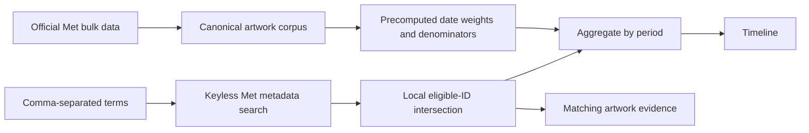

# Mnemosyne

Mnemosyne is a “Google Ngram for art”: search a visual idea, see how its signal changes across time, and trace every point back to example artworks.

The repository contains the interaction slice and two artifact-backed retrieval
paths. The quickest full-corpus path uses the Met's official Open Access export
and keyless Collection API:

1. Build a versioned Met corpus of public-domain, image-backed, dateable works.
2. Precompute normalized date weights and bin denominators once.
3. Search Met metadata without an API key, intersect IDs locally, and plot the
   date-weighted matching share of each period.
4. Compare one to five comma-separated concepts and inspect matching works.

The embedding path remains available for visual-concept retrieval. It builds
image embeddings and an exact FAISS `IndexFlatIP` index offline, then runs only
the text encoder, exact retrieval, and global top-1% concentration lift at query
time. The image tower never runs in a request.

The web app also retains an explicit Art Institute of Chicago metadata demo.
Its chart is explicitly labelled **relative result density**, not historical
prevalence or concentration lift. `MNEMOSYNE_SEARCH_MODE` must name the active
backend, so an unavailable artifact service cannot silently change the metric.

## Run locally

```bash
npm install
cp .env.example .env.local
npm run dev
```

Open [http://localhost:3000](http://localhost:3000). The example environment uses
the keyless `catalogue-demo` mode, so no API key or local dataset is required.

Enter concepts such as `horse, ship, train`. A comma inside one concept can be
quoted: `"still life, fruit", flowers`. Up to five unique lines are supported.

```bash
npm run check
npm test
npm run build
```

## Run Art Ngram over the Met

Clone a pinned copy of the Met's official Open Access data, build the local
denominators, and start the keyword service:

```bash
git clone --depth 1 https://github.com/metmuseum/openaccess.git /path/to/met-openaccess
git -C /path/to/met-openaccess rev-parse HEAD

python3 -m pip install -r pipeline/requirements.txt
python3 -m pipeline build-met \
  --input /path/to/met-openaccess/MetObjects.csv \
  --output /path/to/artifacts/met-openaccess-v1 \
  --corpus-version met-openaccess-v1 \
  --source-revision COPY_THE_COMMIT_PRINTED_ABOVE \
  --retrieved-at 2026-08-03T00:00:00Z

python3 -m pip install -e ./service
mnemosyne-search \
  --artifacts /path/to/artifacts/met-openaccess-v1 \
  --met-keyword \
  --host 127.0.0.1 \
  --port 8765
```

`build-met` snapshots the Met API's image-bearing object IDs beside the source
CSV. Pass `--image-ids /path/to/saved-search.json` to reuse an existing snapshot.
No images or embeddings are downloaded for this mode. Copy `.env.example` to
`.env.local`, set `MNEMOSYNE_SEARCH_MODE=artifact`, run `npm run dev`, and the
web route will proxy to the service.

The plotted value is `matching date weight / eligible date weight` for each
bin. It measures the frequency of a term in Met catalogue metadata, not the
visual prevalence of that concept in the images.

## Run the embedding search path

The corpus and embedding builders are documented in
[`pipeline/README.md`](pipeline/README.md). They use a local clean dataset and a
pinned local SigLIP 2 revision; they do not crawl museum pages or call hosted
inference APIs.

```bash
python3 -m pip install -r pipeline/requirements.txt
python3 -m pipeline build --help
python3 -m pipeline embed --help
```

Start the persistent local query service after building an embedding bundle:

```bash
python3 -m pip install -e './service[siglip2,faiss]'
mnemosyne-search \
  --artifacts /path/to/embedding-bundle \
  --siglip2 \
  --host 127.0.0.1 \
  --port 8765
```

Copy `.env.example` to `.env.local`, set `MNEMOSYNE_SEARCH_MODE=artifact`, and
run the web app. The Next.js route proxies to the service; model paths and
service details stay server-side, and the end user supplies no API key. Local
artifact images are served through the backend and a same-origin web route. See
[`service/README.md`](service/README.md)
for the complete artifact contract and fixture-only startup command.

## Verification

```bash
python3 -m unittest discover -s pipeline/tests -v
PYTHONPATH=service python3 -m unittest discover -s service/tests -v
npm test
npm run check
npm run build
```

The suites include real boundary tests for both paths: temporary corpus builds,
Met keyword frequency and evidence, and embedding-based independent series.

## High-level architecture



The product has two inseparable outputs: a temporal trace and the artworks that produced it. Keeping the evidence trail first-class makes surprising peaks inspectable and exposes collection bias instead of hiding it behind a smooth chart.

See [`docs/architecture.md`](docs/architecture.md) for the metric definition,
corpus caveats, validation gates, and scaling decisions.

## Deployment from a phone

The catalogue fallback is a standard Next.js deployment. The artifact-backed
path additionally needs the persistent Python service and its local model/index
bundle; it should not be placed in a short-lived serverless function.

`request change in Codex → review preview → merge PR → production deploy`

## Data attribution

The fallback uses the [Art Institute of Chicago public API](https://api.artic.edu/docs/)
and its IIIF image service. Artifact builds retain source-record, metadata
license, rights, credit, and public-domain fields; dataset and image terms must
still be reviewed before a production corpus is distributed.
