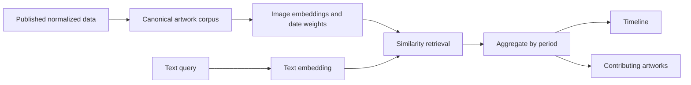

# Mnemosyne

Mnemosyne is a “Google Ngram for art”: search a visual idea, see how its signal changes across time, and trace every point back to example artworks.

The repository now contains both the interaction slice and the artifact-backed
retrieval path:

1. Build a versioned canonical corpus from a local, pinned `ArtiFact_clean` CSV.
2. Precompute normalized date weights, bin denominators, image embeddings, and
   an exact FAISS `IndexFlatIP` index (with a NumPy fallback).
3. Encode text locally and calculate global top-1% concentration lift at query
   time; the image tower never runs in the request path.
4. Compare one to five comma-separated concepts on shared bins and inspect the
   artworks behind any line and period.

The web app also retains a zero-setup Art Institute of Chicago metadata mode.
Its chart is explicitly labelled **relative result density**, not historical
prevalence or concentration lift. Set `MNEMOSYNE_SEARCH_SERVICE_URL` to use a
locally hosted artifact-backed service instead.

## Run locally

```bash
npm install
npm run dev
```

Open [http://localhost:3000](http://localhost:3000). No API key or local dataset is required.

Enter concepts such as `horse, ship, train`. A comma inside one concept can be
quoted: `"still life, fruit", flowers`. Up to five unique lines are supported.

```bash
npm run check
npm test
npm run build
```

## Run the artifact-backed search path

The corpus and embedding builders are documented in
[`pipeline/README.md`](pipeline/README.md). They use a local clean dataset and a
pinned local SigLIP 2 revision; they do not crawl museum pages or call hosted
inference APIs.

```bash
python3 -m pip install -r pipeline/requirements.txt
python3 -m pipeline build --help
python3 -m pipeline embed --help
```

Start the persistent local query service after building an embedding bundle:

```bash
python3 -m pip install -e './service[siglip2,faiss]'
mnemosyne-search \
  --artifacts /path/to/embedding-bundle \
  --siglip2 \
  --host 127.0.0.1 \
  --port 8765
```

Then copy `.env.example` to `.env.local` and run the web app. The Next.js route
proxies to the service; model paths and service details stay server-side, and
the end user supplies no API key. See [`service/README.md`](service/README.md)
for the complete artifact contract and fixture-only startup command.

## Verification

```bash
python3 -m unittest discover -s pipeline/tests -v
PYTHONPATH=service python3 -m unittest discover -s service/tests -v
npm test
npm run check
npm run build
```

The service suite includes a real boundary test that builds a temporary corpus,
embeds it offline, loads the resulting bundle, and serves independent aligned
search series.

## High-level architecture



The product has two inseparable outputs: a temporal trace and the artworks that produced it. Keeping the evidence trail first-class makes surprising peaks inspectable and exposes collection bias instead of hiding it behind a smooth chart.

See [`docs/architecture.md`](docs/architecture.md) for the metric definition,
corpus caveats, validation gates, and scaling decisions.

## Deployment from a phone

The catalogue fallback is a standard Next.js deployment. The artifact-backed
path additionally needs the persistent Python service and its local model/index
bundle; it should not be placed in a short-lived serverless function.

`request change in Codex → review preview → merge PR → production deploy`

## Data attribution

The fallback uses the [Art Institute of Chicago public API](https://api.artic.edu/docs/)
and its IIIF image service. Artifact builds retain source-record, metadata
license, rights, credit, and public-domain fields; dataset and image terms must
still be reviewed before a production corpus is distributed.
